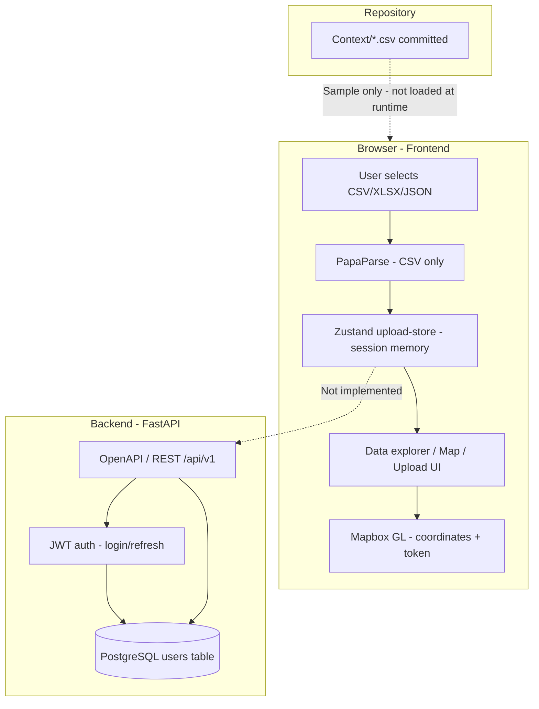

# CRAC-0003: Data handling compliance review

| Field | Value |
|-------|-------|
| **Ticket** | CRAC-0003 |
| **Title** | Review data handling procedures for compliance |
| **Review date** | 2026-05-21 |
| **Scope** | Crack Detection monorepo (`backend/`, `frontend/`, `Context/`, Docker/scripts) at prototype stage |
| **Reviewer** | Automated codebase review (Sunset agent) |
| **Status** | Complete — remediation outstanding |

## Executive summary

This review assesses how the Crack Detection prototype collects, stores, processes, and exposes data against typical internal data protection expectations for prototype testing. The application handles **two distinct data categories**:

1. **User account data** (email, name, password hashes) — persisted in PostgreSQL via the FastAPI backend.
2. **Survey / geospatial metadata** (UTM coordinates, timestamps, image filenames, orientation) — parsed and held **only in the browser** today; a full Ladybug-style export is also **committed in the repository**.

**Overall posture:** Suitable for local development with synthetic data only. **Not ready** for prototype testing with real internal survey data until high-severity findings are addressed.

| Severity | Count | Must fix before real-data testing? |
|----------|-------|-----------------------------------|
| High | 8 | Yes |
| Medium | 12 | Recommended before shared/staging environments |
| Low | 7 | Address during hardening |

---

## Review methodology

1. Static analysis of source under `backend/src/`, `frontend/src/`, root and service `docker-compose.yml`, environment examples, and `scripts/`.
2. Inspection of sample data in `Context/` and test fixtures.
3. Trace of data flows from upload UI through client state, API auth, database models, logging, and third-party integrations (Mapbox).
4. Comparison against common internal policy themes: data minimisation, access control, secrets management, retention, sub-processor transparency, and secure development defaults.

This document is a **technical compliance review**, not legal advice. Map findings to your organisation's data protection policy and applicable law.

---

## Data inventory

### Personal and account data (backend)

| Data element | Classification | Storage | Code reference |
|--------------|----------------|---------|----------------|
| Email | Personal identifier | `users.email` | `backend/src/users/models.py` |
| Full name | Personal data (optional) | `users.full_name` | `backend/src/users/models.py` |
| Password (transit) | Sensitive | Hashed with bcrypt before persistence | `backend/src/core/security.py`, `backend/src/users/service.py` |
| Hashed password | Security credential | `users.hashed_password` | `backend/src/users/models.py` |
| JWT subject (`sub`) | Pseudonymous identifier | Token payload only | `backend/src/core/security.py` |

**API surface:** Registration (superuser), login, refresh, profile read/update, user list/delete — `backend/src/users/router.py`, `backend/src/auth/router.py`.

### Survey and geospatial data (frontend + repository)

| Data element | Classification | Storage today | Code reference |
|--------------|----------------|---------------|----------------|
| CSV rows (all columns) | Operational / potentially sensitive infrastructure data | Browser memory (Zustand) | `frontend/src/hooks/use-csv-parser.ts`, `frontend/src/store/upload-store.ts` |
| UTM Easting/Northing/Height | Precise location | In-memory + UI | `frontend/src/components/upload/data-sidebar.tsx` |
| Timestamps, filenames | Operational metadata | In-memory + UI | Upload and data explorer pages |
| Lat/lng (derived) | Location | Mock data; conversion util exists | `frontend/src/lib/utm-to-latlng.ts`, `frontend/src/components/map/mapbox-container.tsx` |

**No backend persistence** exists yet for jobs, crack results, or uploaded files. Client-side “processing” is simulated (`frontend/src/app/(dashboard)/upload/page.tsx`).

### Committed reference data

| Asset | Rows / size | Risk |
|-------|-------------|------|
| `Context/LB5, Camera Ladybug.csv` | 3,743 survey rows (3,744 lines incl. header) with UTM, filenames, timestamps, orientation | **High** — realistic infrastructure-grade geodata in version control |
| `frontend/src/lib/mock-data.ts` | Synthetic Perth-area demo | Low |
| `frontend/src/data/mock-portfolio-jobs.ts` | Synthetic site names | Low |

### Third-party processors

| Service | Data disclosed | Reference |
|---------|----------------|-----------|
| Mapbox | Access token (client bundle), map tile requests, marker coordinates | `frontend/src/lib/mapbox/config.ts`, `frontend/src/components/map/mapbox-container.tsx` |
| picsum.photos | Mock image URLs (demo only) | Jobs portfolio detail page |

---

## Data flow diagram



---

## Controls assessment

### Positive findings

| Control | Evidence |
|---------|----------|
| Passwords hashed with bcrypt | `get_password_hash` in `backend/src/core/security.py` |
| Passwords excluded from API responses | `UserResponse` schema has no password field |
| Minimum password length (8) | `backend/src/users/schemas.py` |
| `.env` files gitignored | Root and service `.gitignore` |
| No `localStorage` / `sessionStorage` for survey data | Grep across `frontend/src` |
| Zustand not persisted to disk | No `persist` middleware on upload store |
| Generic login failure message | `backend/src/auth/router.py` — avoids distinguishing invalid email vs password |
| SQL echo disabled by default | `DATABASE_ECHO: bool = False` in `backend/src/core/config.py` |

### Gaps (summarised; detail in findings below)

- No privacy policy, retention schedule, or sub-processor register in the repository.
- Dashboard routes are not authenticated; login is a placeholder.
- Weak default secrets and database credentials in Docker and application defaults.
- Realistic survey CSV committed under `Context/`.
- OpenAPI documentation always enabled.
- Frontend API client logs request bodies in debug mode (risk when auth is wired).
- No rate limiting, TLS enforcement, or token revocation.

---

## Non-compliance findings

Each finding has an ID for tracking: `CRAC-0003-{severity}{number}`.

### High severity

<a id="h1--survey-geodata-in-version-control"></a>

#### CRAC-0003-H1 — Survey geodata in version control

| | |
|---|---|
| **Policy theme** | Data minimisation; limit distribution of operational survey data |
| **Evidence** | `Context/LB5, Camera Ladybug.csv` — 3,743 data rows with UTM coordinates (~486247 E, ~7039339 N), timestamps, image filenames, and camera orientation. Not listed in `.gitignore`. |
| **Risk** | Unauthorised access via repository clone; inability to honour erasure if data subject to real locations |
| **Recommendation** | Remove file from git history; add `Context/*.csv` to `.gitignore` or replace with anonymised/synthetic sample; document lawful basis if real data must be kept; restrict repo access |

<a id="h2--weak-default-secrets"></a>

#### CRAC-0003-H2 — Weak default secrets

| | |
|---|---|
| **Policy theme** | Confidentiality; secrets management |
| **Evidence** | `SECRET_KEY: str = "dev-secret-key-change-in-production"` in `backend/src/core/config.py`; same value in `docker-compose.yml` and `backend/docker-compose.yml` |
| **Risk** | Predictable JWT signing in any environment using defaults |
| **Recommendation** | Require strong `SECRET_KEY` via environment; fail application startup if default key detected when `ENVIRONMENT=production`; use a secrets manager for deployed environments |

#### CRAC-0003-H3 — Database default credentials and host exposure

| | |
|---|---|
| **Policy theme** | Access control; defence in depth |
| **Evidence** | `POSTGRES_PASSWORD: postgres`, port `5432:5432` published in `docker-compose.yml`; default `DATABASE_URL` includes `postgres:postgres` |
| **Risk** | Trivial compromise if compose stack exposed beyond localhost |
| **Recommendation** | Do not publish database port in production; use strong credentials; network-isolate DB; enable SSL for DB connections |

<a id="h4--unauthenticated-dashboard"></a>

#### CRAC-0003-H4 — Unauthenticated dashboard

| | |
|---|---|
| **Policy theme** | Access control; need-to-know |
| **Evidence** | `frontend/src/app/page.tsx` redirects to `/dashboard`; `frontend/src/app/(auth)/login/page.tsx` is a placeholder; no Next.js `middleware.ts` |
| **Risk** | Anyone with network access can view upload UI and in-memory survey data during a session |
| **Recommendation** | Implement auth middleware on all `(dashboard)` routes; integrate login with backend JWT; store tokens securely (prefer httpOnly cookies over `localStorage`) |

#### CRAC-0003-H5 — Client-only survey processing without boundary controls

| | |
|---|---|
| **Policy theme** | Processing integrity; accountability |
| **Evidence** | Full CSV parsed and displayed in browser (`frontend/src/app/(dashboard)/data/page.tsx`); no server-side upload, encryption, audit trail, or retention API |
| **Risk** | No organisational control over processing when users load real exports; data visible in DOM and devtools |
| **Recommendation** | When building the pipeline: server-side upload with RBAC, encryption at rest, audit logging, retention/deletion APIs, and data minimisation (store only required columns) |

<a id="h6--missing-governance-documentation"></a>

#### CRAC-0003-H6 — Missing governance documentation

| | |
|---|---|
| **Policy theme** | Transparency; accountability |
| **Evidence** | No privacy notice, retention policy, cookie/consent text, DPIA, ROPA, or sub-processor list in repository |
| **Risk** | Testers cannot assess lawful basis or user rights; Mapbox processing undocumented |
| **Recommendation** | Publish privacy notice and retention schedule; document Mapbox as sub-processor; define process for access/erasure requests |

#### CRAC-0003-H7 — Public API documentation in all environments

| | |
|---|---|
| **Policy theme** | Security by design |
| **Evidence** | `docs_url` and `redoc_url` always set in `backend/src/main.py` |
| **Risk** | Attack surface enumeration in staging/production |
| **Recommendation** | Disable or protect OpenAPI/ReDoc when `ENVIRONMENT != development` |

#### CRAC-0003-H8 — Precise coordinates sent to Mapbox

| | |
|---|---|
| **Policy theme** | Third-party processing; data transfer |
| **Evidence** | `mapbox-container.tsx` renders markers from crack/result coordinates; `NEXT_PUBLIC_MAPBOX_TOKEN` embedded in client bundle |
| **Risk** | Infrastructure locations disclosed to US-based sub-processor |
| **Recommendation** | Document in sub-processor register; obtain consent where required; use scoped/URL-restricted tokens; consider self-hosted tiles for sensitive deployments |

---

### Medium severity

| ID | Issue | Evidence | Recommendation |
|----|-------|----------|----------------|
| CRAC-0003-M1 | JWT refresh without rotation/revocation | `backend/src/auth/router.py` | Rotate refresh tokens; revocation list; logout endpoint |
| CRAC-0003-M2 | Permissive CORS | `allow_methods=["*"]`, `allow_headers=["*"]`, `allow_credentials=True` in `main.py` | Restrict to required origins, methods, headers |
| CRAC-0003-M3 | No API rate limiting | No middleware | Rate-limit login, refresh, and user creation |
| CRAC-0003-M4 | Email enumeration on registration | `ConflictError("Email already registered")` in `users/service.py` | Generic conflict message |
| CRAC-0003-M5 | API client logs request bodies | `apiLogger.debug(..., { params, body })` in `frontend/src/lib/api/client.ts` | Redact credentials; disable body logging in production |
| CRAC-0003-M6 | DB connection errors may leak details | `logger.error("Database connection failed: %s", e)` in `db/session.py` | Log error type only; never log connection strings |
| CRAC-0003-M7 | `DATABASE_ECHO` can log SQL with PII | Config flag in `config.py` | Validate `False` in production |
| CRAC-0003-M8 | No Alembic migration versions | `backend/alembic/` without `versions/` | Add migrations before persisting processing data |
| CRAC-0003-M9 | UI accepts XLSX/JSON but only parses CSV | `csv-upload-zone.tsx` accept list | Validate MIME/types; reject or implement parsers |
| CRAC-0003-M10 | Mapbox token in public env var | `NEXT_PUBLIC_MAPBOX_TOKEN` | Scoped token; rotation; optional server-side proxy |
| CRAC-0003-M11 | No TLS/HTTPS enforcement | HTTP localhost defaults | TLS at reverse proxy; HSTS; secure cookies |
| CRAC-0003-M12 | Hard user delete without audit trail | `delete_user` in `users/service.py` | Soft-delete and audit log |

---

### Low severity

| ID | Issue | Evidence | Recommendation |
|----|-------|----------|----------------|
| CRAC-0003-L1 | Health endpoint exposes version | `backend/src/main.py` `/health` | Reduce detail in production |
| CRAC-0003-L2 | Error UI shows raw `error.message` | `dashboard/error.tsx` | Generic user-facing errors |
| CRAC-0003-L3 | Mock location data in source | `mock-data.ts`, `mock-portfolio-jobs.ts` | Label as synthetic in docs |
| CRAC-0003-L4 | No frontend `.env.example` | Only `backend/.env.example` | Add template without secrets |
| CRAC-0003-L5 | `Base.to_dict()` serialises all columns | `backend/src/db/base.py` | Exclude sensitive fields |
| CRAC-0003-L6 | Inactive user error reveals account state | Auth dependency checks | Generic auth failure |
| CRAC-0003-L7 | External picsum.photos in demo UI | Jobs portfolio page | Disable for production builds with real data |

---

## Remediation priority

| Phase | When | Actions |
|-------|------|---------|
| **1 — Immediate** | Before any real survey data in repo or UI | H1, H2 (rotate if repo shared), H6 (draft governance) |
| **2 — Pre shared/staging** | Before team-wide prototype testing | H3, H4, H7, M1–M3, M5–M7, M11 |
| **3 — Pre production pipeline** | Before backend stores uploads/results | H5, H8, M8, M9, M12 |
| **4 — Hardening** | Ongoing | Low-severity items |

---

## Sharing findings with the team

This review is published under `docs/compliance/` for the whole team:

| Audience | Action |
|----------|--------|
| **Engineering** | Create follow-up tickets per finding ID; start with H1–H4 before UAT with real CSV exports |
| **Security / compliance** | Map IDs to internal policy controls; confirm lawful basis for geospatial infrastructure data |
| **Product** | Update test plans to use **synthetic** data only until Phase 1 complete |
| **DevOps** | Enforce secrets and disable public API docs in non-dev environments |

Entry point: [`docs/compliance/README.md`](README.md).

---

## Appendix A — File reference map

```
USER AUTH (server)
  backend/src/users/router.py
  backend/src/users/service.py
  backend/src/users/models.py
  backend/src/auth/router.py
  backend/src/auth/dependencies.py
  backend/src/core/security.py
  backend/src/core/config.py

CSV / SURVEY (client)
  frontend/src/components/upload/csv-upload-zone.tsx
  frontend/src/hooks/use-csv-parser.ts
  frontend/src/store/upload-store.ts
  frontend/src/app/(dashboard)/upload/page.tsx
  frontend/src/app/(dashboard)/data/page.tsx

MAP / GPS
  frontend/src/lib/utm-to-latlng.ts
  frontend/src/components/map/mapbox-container.tsx

SAMPLE DATA
  Context/LB5, Camera Ladybug.csv
  frontend/src/lib/mock-data.ts

DEPLOY / SECRETS
  docker-compose.yml
  backend/.env.example
  scripts/dev.sh (DB volume wipe on start)
```

## Appendix B — Sign-off

| Role | Name | Date | Notes |
|------|------|------|-------|
| Review author | Sunset agent (CRAC-0003) | 2026-05-21 | Initial review |
| Engineering lead | _Pending_ | | |
| Security / compliance | _Pending_ | | |

---

*End of CRAC-0003 compliance review report.*
