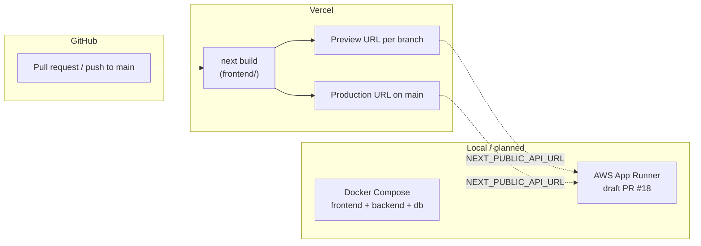

# CRAC-0050: Vercel deployment process and lessons learned

**To:** Engineering, DevOps, and QA  
**From:** Platform / Frontend team  
**Date:** 2026-05-24  
**Subject:** How Crack Detection is deployed to Vercel, and how to avoid repeat build failures  
**Status:** Published — ready for distribution

---

## Summary

Crack Detection is a **monorepo** with a Next.js frontend, FastAPI backend, and PostgreSQL database. **Vercel deploys the frontend only** via GitHub integration. The backend and database run locally through Docker Compose today; a draft AWS App Runner workflow ([PR #18](https://github.com/munsifhayathd/crack-detection/pull/18)) covers future backend deployment.

This document records the current Vercel setup, the step-by-step deployment process, lessons learned from a failed production build on [PR #21](https://github.com/munsifhayathd/crack-detection/pull/21), and best practices for the team.

---

## Deployment architecture



| Environment | Frontend | Backend | Database |
|-------------|----------|---------|----------|
| **Local dev** | `frontend` container (`bun run dev`) | `backend` container (uvicorn reload) | PostgreSQL 16 container |
| **Vercel preview / production** | Vercel (`next build` + edge/CDN) | Not deployed on Vercel — must point to an external API | Not included |
| **Planned production API** | Vercel | AWS App Runner (draft) | Amazon RDS or managed Postgres |

---

## Vercel project configuration

Vercel settings are managed in the [Vercel dashboard](https://vercel.com/munsif-hayats-projects/crack-detection). There is **no `vercel.json`** in the repository; configuration lives in the dashboard.

| Setting | Value | Notes |
|---------|-------|-------|
| **Project name** | `crack-detection` | Team: `munsif-hayats-projects` |
| **Root directory** | `frontend` | Required for monorepo — Vercel must not build from repo root |
| **Monorepo mode** | Enabled | Detects the Next.js app under `frontend/` |
| **Git integration** | GitHub | Automatic preview deploy on every PR; production deploy on merge to `main` |
| **Build command** | `next build` (default) | Equivalent to `bun run build` / `npm run build` in `frontend/package.json` |
| **Install command** | Auto-detected | Repository uses **Bun** (`bun.lock`); Vercel should install with Bun |

### Preview URL pattern

Branch previews follow this pattern:

```text
crack-detection-git-<branch-slug>-munsif-hayats-projects.vercel.app
```

Example from [PR #27](https://github.com/munsifhayathd/crack-detection/pull/27):

```text
crack-detection-git-cursor-sideba-8e32ad-munsif-hayats-projects.vercel.app
```

---

## Deployment process

### 1. Local development (full stack)

Use Docker Compose for the complete application:

```bash
./scripts/dev.sh    # Fresh build + live logs (resets DB)
./scripts/start.sh  # Detached start with health checks
./scripts/stop.sh   # Stop containers (preserves DB volume)
```

Key URLs when running locally:

| Service | URL |
|---------|-----|
| Frontend | http://localhost:3000 |
| Backend API | http://localhost:8000/api/v1 |
| API health | http://localhost:8000/health |
| Frontend health | http://localhost:3000/api/health |

See [CLAUDE.md](../../CLAUDE.md) for backend-only and frontend-only commands.

### 2. Frontend-only local verification (pre-push)

Before opening or merging a PR that touches the frontend, run a **production build** locally. Vercel runs the same `next build` step; catching failures locally avoids broken preview deploys.

```bash
cd frontend
bun install          # or: npm install
bun run lint         # ESLint
bun run build        # Production build (TypeScript + static generation)
```

Optional — run the production server locally to smoke-test:

```bash
bun run start        # Serves on http://localhost:3000
```

### 3. Automatic Vercel preview (pull requests)

1. Push a branch and open a PR against `main`.
2. Vercel detects the push and builds from `frontend/`.
3. The **vercel** bot comments on the PR with build status and a **Preview** link when successful.
4. QA and reviewers use the preview URL to validate UI changes before merge.

**Do not merge** a frontend PR while the Vercel check shows **Error** unless the failure is confirmed unrelated (for example, a transient Vercel platform issue).

### 4. Production deploy (merge to main)

1. Merge the PR to `main`.
2. Vercel builds and promotes the deployment to the production URL configured in the dashboard.
3. Confirm the Vercel bot comment or dashboard shows a successful deployment.

### 5. Environment variables (Vercel dashboard)

Set these under **Project → Settings → Environment Variables** for Preview and Production scopes as needed:

| Variable | Purpose | Default in code if unset |
|----------|---------|--------------------------|
| `NEXT_PUBLIC_API_URL` | Backend API base URL | `http://localhost:8000/api/v1` |
| `NEXT_PUBLIC_APP_URL` | Canonical frontend URL | `http://localhost:3000` |
| `NEXT_PUBLIC_MAPBOX_TOKEN` | Mapbox GL access token | `""` (map shows fallback UI) |

**Important:** Without `NEXT_PUBLIC_API_URL` set in Vercel, a deployed preview will attempt to call `localhost:8000` from the user's browser, which will fail. Set this to the reachable backend URL (local tunnel for testing, or AWS App Runner URL once backend deployment is live).

Configuration references in code:

- `frontend/src/config/api.ts` — `NEXT_PUBLIC_API_URL`
- `frontend/src/config/site.ts` — `NEXT_PUBLIC_APP_URL`
- `frontend/src/lib/mapbox/config.ts` — `NEXT_PUBLIC_MAPBOX_TOKEN`

### 6. Backend CORS (when API is external)

The backend defaults to allowing only `http://localhost:3000`:

```25:25:backend/src/core/config.py
    CORS_ORIGINS: list[str] = ["http://localhost:3000"]
```

When the frontend runs on Vercel, add the preview and production Vercel URLs to `CORS_ORIGINS` in the backend environment (JSON array format, as used in `docker-compose.yml`):

```json
["http://localhost:3000", "https://crack-detection.vercel.app", "https://crack-detection-git-<branch>-munsif-hayats-projects.vercel.app"]
```

Use the exact origins Vercel assigns; wildcard subdomains are not supported by default CORS configuration.

### 7. Planned backend deployment (AWS)

Backend deployment is **not yet merged** to `main`. Draft [PR #18](https://github.com/munsifhayathd/crack-detection/pull/18) adds a GitHub Actions workflow that:

1. Builds `backend/Dockerfile` (Gunicorn + Uvicorn, port 8000).
2. Pushes the image to Amazon ECR.
3. Deploys to AWS App Runner with health check at `/health`.

Once live, set `NEXT_PUBLIC_API_URL` on Vercel to the App Runner service URL and update backend `CORS_ORIGINS` accordingly.

---

## Incident: PR #21 Vercel build failure

### What happened

| Item | Detail |
|------|--------|
| **PR** | [#21 — Implement routing for welcome page](https://github.com/munsifhayathd/crack-detection/pull/21) |
| **Date** | 2026-05-22 |
| **Vercel status** | **Error** — `nextCommitStatus: "FAILED"` |
| **Merge** | PR was merged to `main` despite the failed Vercel check |

### Root cause

A merge conflict in `frontend/src/components/layout/sidebar.tsx` left a **duplicate import** of `Sparkles` from `lucide-react`:

```typescript
import {
  // ...
  Sparkles,
  PanelLeftClose,
  PanelLeft,
  Sparkles,  // duplicate — introduced during merge
} from "lucide-react";
```

This violates TypeScript's duplicate identifier rules. Vercel runs `next build`, which includes a TypeScript check; the build failed before a preview URL could be published.

The duplicate was introduced in merge commit `bb52719` (`Merge branch 'main' into cursor/implement-welcome-page-routing-fea1`) and landed on `main` via merge commit `56017d5`.

### Resolution

A subsequent change removed the duplicate import. Current `sidebar.tsx` imports `Sparkles` once and **local `npm run build` succeeds** on `main`.

Later PRs ([#27](https://github.com/munsifhayathd/crack-detection/pull/27), [#28](https://github.com/munsifhayathd/crack-detection/pull/28)) show successful Vercel preview and production deploys.

### Why it was easy to miss

- The diff in PR #21 was small (routing change) and did not obviously touch imports.
- The duplicate came from **merge conflict resolution**, not from feature code written on the branch.
- GitHub did not block merge on the failed Vercel status.

---

## Lessons learned

| # | Lesson | Action |
|---|--------|--------|
| 1 | Vercel runs a **production build**, not the dev server | Always run `bun run build` locally before merge |
| 2 | Merge conflicts can introduce subtle TypeScript errors | After resolving conflicts, re-run lint and build |
| 3 | Failed Vercel checks are release blockers for frontend changes | Do not merge until the Vercel bot shows success or the failure is explained |
| 4 | Monorepo requires explicit **root directory** | Keep Vercel root directory set to `frontend` |
| 5 | Env vars are not in git | Document and set `NEXT_PUBLIC_*` in the Vercel dashboard |
| 6 | Frontend and backend deploy separately | Plan `NEXT_PUBLIC_API_URL` and `CORS_ORIGINS` together |
| 7 | Docker frontend uses dev mode | `frontend/Dockerfile` runs `bun run dev`; do not assume Docker behavior matches Vercel |

---

## Best practices

### Before opening a frontend PR

- [ ] `bun run lint` passes in `frontend/`
- [ ] `bun run build` passes in `frontend/`
- [ ] If you resolved merge conflicts, scan imports and exports for duplicates
- [ ] New routes appear in the build output table (`next build` lists all routes)

### During review

- [ ] Vercel bot comment shows **Ready** (not **Error** or stuck **Building**)
- [ ] Open the **Preview** link and smoke-test affected pages
- [ ] For API-dependent features, confirm `NEXT_PUBLIC_API_URL` is set for Preview env or test with mock/local backend via tunnel

### After merge

- [ ] Confirm production deployment succeeded in Vercel dashboard
- [ ] Spot-check production URL for the changed feature
- [ ] Update env vars if the change requires new `NEXT_PUBLIC_*` values

### Monorepo checklist (Vercel dashboard)

- [ ] **Root Directory:** `frontend`
- [ ] **Framework Preset:** Next.js
- [ ] **Install Command:** Bun (auto or explicit `bun install`)
- [ ] **Build Command:** `next build` or `bun run build`
- [ ] **Output Directory:** `.next` (default)

---

## Troubleshooting

| Symptom | Likely cause | Fix |
|---------|--------------|-----|
| Vercel build **Error** on PR | TypeScript, ESLint, or missing dependency | Read build log in Vercel dashboard; reproduce with `bun run build` locally |
| Preview loads but API calls fail | `NEXT_PUBLIC_API_URL` unset or points to localhost | Set env var in Vercel Preview scope |
| Map page empty / placeholder | `NEXT_PUBLIC_MAPBOX_TOKEN` missing | Add token in Vercel env vars |
| Browser CORS error on API | Backend `CORS_ORIGINS` missing Vercel URL | Add Vercel origin to backend env |
| Build works locally, fails on Vercel | Node/Bun version mismatch or missing env | Align package manager; check Vercel build logs for install step |
| Wrong app built | Root directory not `frontend` | Fix **Root Directory** in project settings |

### Health checks

| Check | Endpoint |
|-------|----------|
| Frontend (Vercel) | `GET /api/health` → `{ "status": "healthy", ... }` |
| Backend (when deployed) | `GET /health` |

---

## Verification performed (2026-05-24)

| Check | Result |
|-------|--------|
| `npm run build` in `frontend/` on current `main` | Pass — all routes compiled |
| Duplicate `Sparkles` import at merge commit `56017d5` | Confirmed — would fail TypeScript |
| Current `sidebar.tsx` | Single `Sparkles` import |
| Vercel preview deploys on PRs #27, #28 | Success per Vercel bot comments |

---

## Distribution

Share this document with the development team using:

1. **Slack** — Post in `#crack-detection` with link to this file on `main`; pin for two weeks.
2. **Onboarding** — Add to new-engineer setup: read CRAC-0050 before first frontend PR.
3. **PR template / review culture** — Treat green Vercel preview as required for frontend merges.
4. **Vercel dashboard access** — Ensure at least two engineers can view build logs and edit env vars.

---

## References

- Vercel project: https://vercel.com/munsif-hayats-projects/crack-detection
- Failed build (PR #21): https://vercel.com/munsif-hayats-projects/crack-detection/8XrUuAtUZa8WeSffGjGt458thgNq
- [docs/deployment/README.md](README.md) — deployment doc index
- [CLAUDE.md](../../CLAUDE.md) — local development
- [PR #18 — AWS backend workflow (draft)](https://github.com/munsifhayathd/crack-detection/pull/18)
