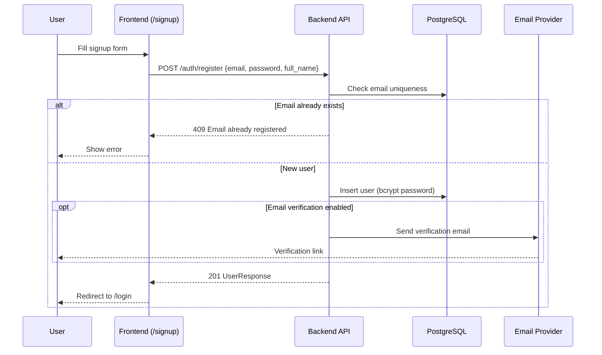

# Signup and Email Functionality

This guide documents the user registration (signup) flow and email integration for the Crack Detection application. It is intended for developers implementing or extending auth features and for IT support configuring and troubleshooting environments.

**Related code:**

| Area | Location |
|------|----------|
| Auth API | `backend/src/auth/` |
| User API & service | `backend/src/users/` |
| JWT & password hashing | `backend/src/core/security.py` |
| Application settings | `backend/src/core/config.py` |
| Login page (placeholder) | `frontend/src/app/(auth)/login/page.tsx` |
| API client | `frontend/src/lib/api/client.ts` |
| Environment example | `backend/.env.example` |

---

## Table of Contents

1. [Overview](#overview)
2. [Signup Page Setup](#signup-page-setup)
3. [Email Service Integration](#email-service-integration)
4. [End-to-End Signup Flow](#end-to-end-signup-flow)
5. [Environment Configuration Reference](#environment-configuration-reference)
6. [Troubleshooting](#troubleshooting)

---

## Overview

### Current state

The application has **partial authentication infrastructure**:

- **Backend:** JWT-based login (`POST /api/v1/auth/login`), token refresh, and user CRUD. User creation via `POST /api/v1/users/` requires a **superuser** bearer token — there is no public signup endpoint yet.
- **Frontend:** A placeholder login page exists at `/login`. There is **no signup page** (`/signup`) and no auth state management wired to the API.
- **Email:** No outbound email service is configured. The `email-validator` package is used only for Pydantic email format validation on user schemas.

### Target state

The signup and email features are designed to work together:

1. A user submits a signup form on the frontend (`/signup`).
2. The backend creates the account (public registration endpoint) and optionally sends a verification email.
3. The user verifies their email (if enabled) and signs in via `/login`.
4. Transactional emails (verification, password reset, welcome) are sent through a configured SMTP or transactional email provider.

The sections below describe how to set up, configure, and troubleshoot both areas.

---

## Signup Page Setup

### Prerequisites

Before working on signup, ensure the stack is running and the database is migrated:

```bash
# Full stack (Docker) — resets DB volume on first run via dev.sh
./scripts/dev.sh

# Or start detached
./scripts/start.sh
```

For backend-only development:

```bash
cd backend
pip install -r requirements.txt
alembic upgrade head          # Create/update users table
uvicorn src.main:app --reload --port 8000
```

For frontend-only development:

```bash
cd frontend
bun install
bun dev                       # http://localhost:3000
```

Confirm the API is reachable at `http://localhost:8000/health` and Swagger docs at `http://localhost:8000/api/v1/docs`.

### Frontend: creating the signup page

The frontend uses Next.js App Router with an `(auth)` route group for unauthenticated pages. Follow these steps to add the signup page.

#### 1. Create the route

Add a new page at:

```
frontend/src/app/(auth)/signup/page.tsx
```

The `(auth)` group keeps auth pages separate from the dashboard layout in `(dashboard)/`. No shared auth layout exists yet; mirror the centered layout used by the login placeholder.

#### 2. Build the signup form

Use existing shadcn/ui components from `frontend/src/components/ui/`:

- `Input` — email, full name, password, confirm password
- `Label` — field labels
- `Button` — submit action
- `Card` — optional form container

Recommended form fields (aligned with backend `UserCreate` schema):

| Field | Validation | Notes |
|-------|------------|-------|
| Email | Required, valid email format | Maps to `email` |
| Full name | Optional | Maps to `full_name` |
| Password | Required, min 8 characters | Maps to `password` |
| Confirm password | Must match password | Client-side only |

#### 3. Wire the API call

The shared API client (`frontend/src/lib/api/client.ts`) sends JSON by default. Signup should use:

```http
POST /api/v1/auth/register
Content-Type: application/json

{
  "email": "user@example.com",
  "password": "securepassword",
  "full_name": "Jane Doe"
}
```

> **Note:** The public register endpoint is part of the planned signup implementation. Until it exists, user creation is only available via `POST /api/v1/users/` with a superuser token (see [Bootstrap first user](#bootstrap-first-user) below).

Example signup call using the existing client:

```typescript
import { api } from "@/lib/api/client";

await api.post("/auth/register", {
  email,
  password,
  full_name: fullName || undefined,
});
```

#### 4. Handle API errors

FastAPI returns errors in `{ "detail": "..." }` format. The current `ApiError.fromResponse` helper reads `body.message`, so signup forms should extract `detail` explicitly for user-facing messages:

```typescript
try {
  await api.post("/auth/register", payload);
} catch (error) {
  if (isApiError(error) && error.details) {
    const detail = (error.details as { detail?: string })?.detail;
    // Show detail to the user, e.g. "Email already registered"
  }
}
```

Common signup error responses:

| Status | Detail | Cause |
|--------|--------|-------|
| 409 | `Email already registered` | Duplicate email |
| 422 | Validation errors array | Invalid email format or password too short |
| 400 | Various | Missing required fields |

#### 5. Add navigation links

- Link from `/login` → `/signup` ("Don't have an account? Sign up")
- Link from `/signup` → `/login` ("Already have an account? Sign in")
- After successful signup, redirect to `/login` or auto-login and redirect to `/dashboard`

#### 6. Frontend environment variables

Create or update `frontend/.env.local`:

```env
NEXT_PUBLIC_API_URL=http://localhost:8000/api/v1
NEXT_PUBLIC_APP_URL=http://localhost:3000
```

When running via Docker Compose, these are set in `docker-compose.yml` under the `frontend` service. Rebuild the frontend container after changing env vars:

```bash
docker compose up -d --build frontend
```

#### 7. Protect dashboard routes (recommended)

Once signup and login are wired, add Next.js middleware (`frontend/src/middleware.ts`) to redirect unauthenticated users away from `(dashboard)` routes. Store JWT tokens in `httpOnly` cookies or secure client storage and attach `Authorization: Bearer <token>` headers on authenticated API calls.

### Backend: registration endpoint

The backend user creation logic already exists in `backend/src/users/service.py`:

```python
async def create_user(db: AsyncSession, user_in: UserCreate) -> User:
    existing = await get_user_by_email(db, user_in.email)
    if existing:
        raise ConflictError("Email already registered")
    user = User(
        email=user_in.email,
        full_name=user_in.full_name,
        hashed_password=get_password_hash(user_in.password),
    )
    ...
```

To enable public signup, expose this via a **public** route (e.g. `POST /api/v1/auth/register`) that:

1. Accepts `UserCreate` JSON (no auth required).
2. Calls `create_user`.
3. Optionally triggers a verification email (see [Email Service Integration](#email-service-integration)).
4. Returns `UserResponse` (without password) with status `201`.

The existing superuser-only endpoint `POST /api/v1/users/` remains for admin user management.

### Bootstrap first user

Because `POST /api/v1/users/` requires a superuser JWT, the first account must be created outside the normal signup flow:

**Option A — Direct database insert (development):**

```sql
-- Connect to PostgreSQL (Docker: docker exec -it crack-detection-db psql -U postgres -d crack_detection)
INSERT INTO users (email, hashed_password, full_name, is_active, is_superuser, created_at, updated_at)
VALUES (
  'admin@example.com',
  '$2b$12$...',  -- bcrypt hash generated separately
  'Admin User',
  true,
  true,
  NOW(),
  NOW()
);
```

Generate a bcrypt hash in Python:

```python
from passlib.context import CryptContext
print(CryptContext(schemes=["bcrypt"]).hash("your-password"))
```

**Option B — Swagger UI:**

1. Bootstrap the first superuser via Option A.
2. Log in at `POST /api/v1/auth/login` (use **username** field for email, form-urlencoded).
3. Authorize in Swagger with the access token.
4. Create additional users via `POST /api/v1/users/`.

---

## Email Service Integration

### Purpose

Email supports these transactional flows in the signup and auth lifecycle:

| Email type | Trigger | Purpose |
|------------|---------|---------|
| Verification | User signs up | Confirm email ownership before full access |
| Welcome | After verification or signup | Onboard the user |
| Password reset | User requests reset | Send a time-limited reset link |

### Architecture

Email sending is handled by the **backend** only. The frontend never talks to the email provider directly.

```
┌─────────────┐     POST /auth/register      ┌─────────────┐     SMTP/API     ┌──────────────┐
│   Frontend  │ ────────────────────────────▶│   Backend   │ ────────────────▶│ Email Provider│
│  /signup    │                              │ email module│                  │ (SendGrid,    │
└─────────────┘                              └─────────────┘                  │  SES, SMTP)   │
                                               │                             └──────────────┘
                                               ▼
                                         ┌─────────────┐
                                         │  PostgreSQL │
                                         │  (users)    │
                                         └─────────────┘
```

Recommended backend module layout (to be implemented):

```
backend/src/email/
├── __init__.py
├── service.py       # send_email(), send_verification(), send_password_reset()
├── templates/       # HTML/text email templates
│   ├── verification.html
│   ├── welcome.html
│   └── password_reset.html
└── schemas.py       # EmailPayload, template context models
```

### Provider options

Choose one provider for each environment. All options use environment variables — never hardcode credentials.

#### Option 1: SMTP (generic)

Works with any SMTP server (Microsoft 365, Gmail relay, on-prem Exchange, etc.).

| Variable | Description | Example |
|----------|-------------|---------|
| `EMAIL_ENABLED` | Master switch | `true` |
| `EMAIL_FROM` | Sender address | `noreply@yourdomain.com` |
| `EMAIL_FROM_NAME` | Display name | `Crack Detection` |
| `SMTP_HOST` | SMTP server hostname | `smtp.office365.com` |
| `SMTP_PORT` | Port (587 for TLS, 465 for SSL) | `587` |
| `SMTP_USER` | SMTP username | `noreply@yourdomain.com` |
| `SMTP_PASSWORD` | SMTP password or app password | *(set in secrets manager)* |
| `SMTP_USE_TLS` | Enable STARTTLS | `true` |

#### Option 2: SendGrid (API)

| Variable | Description | Example |
|----------|-------------|---------|
| `EMAIL_ENABLED` | Master switch | `true` |
| `EMAIL_FROM` | Verified sender | `noreply@yourdomain.com` |
| `SENDGRID_API_KEY` | SendGrid API key | *(set in secrets manager)* |

#### Option 3: Amazon SES

| Variable | Description | Example |
|----------|-------------|---------|
| `EMAIL_ENABLED` | Master switch | `true` |
| `EMAIL_FROM` | Verified sender | `noreply@yourdomain.com` |
| `AWS_REGION` | SES region | `us-east-1` |
| `AWS_ACCESS_KEY_ID` | IAM access key | *(set in secrets manager)* |
| `AWS_SECRET_ACCESS_KEY` | IAM secret | *(set in secrets manager)* |

### Settings integration

Add email settings to `backend/src/core/config.py` (planned):

```python
EMAIL_ENABLED: bool = False
EMAIL_FROM: str = "noreply@localhost"
EMAIL_FROM_NAME: str = "Crack Detection"
SMTP_HOST: str = ""
SMTP_PORT: int = 587
SMTP_USER: str = ""
SMTP_PASSWORD: str = ""
SMTP_USE_TLS: bool = True
FRONTEND_URL: str = "http://localhost:3000"  # Used in email links
```

Add corresponding entries to `backend/.env.example` and document them in deployment secrets (never commit real credentials).

### Docker Compose configuration

For local development with email disabled (default):

```yaml
backend:
  environment:
    EMAIL_ENABLED: "false"
```

For staging/production, inject email variables via `.env` or your secrets manager and set `EMAIL_ENABLED: "true"`.

### Verification email flow

When email verification is enabled:

1. On signup, generate a signed, time-limited verification token (JWT or random token stored in DB).
2. Send email with link: `{FRONTEND_URL}/verify-email?token=<token>`.
3. Frontend calls `POST /api/v1/auth/verify-email` with the token.
4. Backend validates token, sets `email_verified=True` on the user (requires a new DB column).
5. Optionally restrict login or certain features until verified.

### Password reset flow

1. User submits email on `/forgot-password`.
2. Backend generates a reset token (single-use, expires in ~1 hour).
3. Send email with link: `{FRONTEND_URL}/reset-password?token=<token>`.
4. User submits new password; backend validates token and updates hash.

### Testing email locally

| Approach | When to use |
|----------|-------------|
| `EMAIL_ENABLED=false` | Default dev — log email content instead of sending |
| [Mailpit](https://mailpit.axllent.org/) / MailHog | Local SMTP capture — point `SMTP_HOST=localhost`, `SMTP_PORT=1025` |
| Provider sandbox | SendGrid/SES sandbox with verified recipients only |

---

## End-to-End Signup Flow



### Login after signup

Login uses **form-urlencoded** data (OAuth2 password flow), not JSON:

```http
POST /api/v1/auth/login
Content-Type: application/x-www-form-urlencoded

username=user@example.com&password=securepassword
```

The `username` field carries the **email address**. On success, the API returns:

```json
{
  "access_token": "...",
  "refresh_token": "...",
  "token_type": "bearer"
}
```

Use the access token as `Authorization: Bearer <access_token>` on protected routes (e.g. `GET /api/v1/users/me`). Refresh expired access tokens via `POST /api/v1/auth/refresh` with `{ "refresh_token": "..." }`.

---

## Environment Configuration Reference

### Backend (`backend/.env`)

| Variable | Required | Default | Purpose |
|----------|----------|---------|---------|
| `SECRET_KEY` | Yes (production) | dev default | JWT signing key |
| `ALGORITHM` | No | `HS256` | JWT algorithm |
| `ACCESS_TOKEN_EXPIRE_MINUTES` | No | `30` | Access token TTL |
| `REFRESH_TOKEN_EXPIRE_DAYS` | No | `7` | Refresh token TTL |
| `CORS_ORIGINS` | No | `["http://localhost:3000"]` | Allowed frontend origins |
| `DATABASE_URL` | Yes | local default | PostgreSQL connection string |
| `EMAIL_ENABLED` | No | `false` | Enable outbound email |
| `EMAIL_FROM` | If email enabled | — | Sender email address |
| `SMTP_HOST` | If using SMTP | — | SMTP server |
| `SMTP_PORT` | If using SMTP | `587` | SMTP port |
| `SMTP_USER` | If using SMTP | — | SMTP credentials |
| `SMTP_PASSWORD` | If using SMTP | — | SMTP credentials |
| `FRONTEND_URL` | If email enabled | `http://localhost:3000` | Base URL for email links |

### Frontend (`frontend/.env.local`)

| Variable | Required | Default | Purpose |
|----------|----------|---------|---------|
| `NEXT_PUBLIC_API_URL` | No | `http://localhost:8000/api/v1` | Backend API base URL |
| `NEXT_PUBLIC_APP_URL` | No | `http://localhost:3000` | Frontend base URL (email redirects) |

### Docker Compose overrides

The root `docker-compose.yml` sets backend auth vars and frontend URLs. Add email variables under the `backend` service `environment` block for containerized deployments.

---

## Troubleshooting

### Signup and user creation

#### "Email already registered" (409)

The email is already in the `users` table. Check with:

```sql
SELECT id, email, is_active, created_at FROM users WHERE email = 'user@example.com';
```

Resolution: use a different email, or (admin) delete the existing record if it was created in error.

#### Validation error on password (422)

Password must be at least **8 characters** (`UserCreate` schema in `backend/src/users/schemas.py`). Confirm the frontend enforces the same minimum before submitting.

#### Cannot create any users — no superuser exists

`POST /api/v1/users/` returns 401/403 without a superuser token. Bootstrap the first admin via [direct DB insert](#bootstrap-first-user) or a one-time seed script.

#### Users table does not exist

Run migrations:

```bash
cd backend
alembic revision --autogenerate -m "create users table"
alembic upgrade head
```

Check backend logs for SQLAlchemy errors on startup.

#### Signup succeeds but user cannot log in

| Symptom | Likely cause | Fix |
|---------|--------------|-----|
| 401 "Incorrect email or password" | Wrong password or email typo | Verify credentials; check bcrypt hash in DB |
| 401 "User is inactive" | `is_active=false` | `UPDATE users SET is_active=true WHERE email='...'` |
| 401 from login endpoint | Wrong content type | Login requires `application/x-www-form-urlencoded`, not JSON |
| Login form sends JSON | Frontend client defaults to JSON | Use a dedicated login helper with form encoding |

#### Database wiped after restart

`./scripts/dev.sh` runs `docker compose down -v`, which **removes the Postgres volume**. Users created during a dev session are lost. Use `./scripts/start.sh` (without `-v`) to preserve data, or re-bootstrap after `dev.sh`.

### Frontend / API connectivity

#### Signup or login request fails with network error

1. Confirm backend is running: `curl http://localhost:8000/health`
2. Verify `NEXT_PUBLIC_API_URL` matches the backend address.
3. Check CORS: backend `CORS_ORIGINS` must include the frontend origin (default `http://localhost:3000`).
4. In Docker, ensure the frontend uses `http://localhost:8000/api/v1` (browser-side), not the internal Docker hostname.

#### Generic "Request failed with status 4xx" on frontend

The API returns `{ "detail": "..." }` but `ApiError.fromResponse` reads `message`. Update error handling to surface `detail` (see [Handle API errors](#4-handle-api-errors)).

### Email delivery

#### Emails not sending

1. Confirm `EMAIL_ENABLED=true` in backend environment.
2. Check backend logs for SMTP connection errors.
3. Verify SMTP credentials and that the sender address is authorized by your provider.
4. For SendGrid/SES, confirm the sender domain is verified and the account is out of sandbox mode.

#### Emails go to spam

- Configure SPF, DKIM, and DMARC DNS records for the sending domain.
- Use a consistent `EMAIL_FROM` address that matches the verified domain.
- Avoid URL-only bodies; include plain-text alternatives.

#### Verification / reset links do not work

1. Confirm `FRONTEND_URL` matches the URL users actually visit (include correct scheme and port).
2. Check token expiry settings — expired tokens should prompt the user to request a new email.
3. Ensure the frontend route (`/verify-email`, `/reset-password`) exists and passes the token to the backend.

#### Local development — testing without a real provider

Set `EMAIL_ENABLED=false` and inspect logged email payloads in backend stdout, or run [Mailpit](https://mailpit.axllent.org/) locally:

```bash
docker run -d --name mailpit -p 8025:8025 -p 1025:1025 axllent/mailpit
```

Configure backend:

```env
EMAIL_ENABLED=true
SMTP_HOST=localhost
SMTP_PORT=1025
SMTP_USE_TLS=false
```

Open the Mailpit UI at http://localhost:8025 to view captured messages.

### JWT and session issues

#### Token expired during signup flow

Access tokens expire after 30 minutes by default. Use the refresh token endpoint or redirect to login.

#### "Invalid token type" (401)

Ensure protected routes receive an **access** token, not a refresh token. Token type is encoded in the JWT payload (`type: "access"` vs `type: "refresh"`).

#### Login works in Swagger but not in frontend

Swagger sends form-urlencoded data correctly. The frontend `api.post()` client sends JSON — implement a separate login function that uses `URLSearchParams` and `Content-Type: application/x-www-form-urlencoded`.

---

## Quick reference: key API endpoints

| Method | Path | Auth | Description |
|--------|------|------|-------------|
| `POST` | `/api/v1/auth/login` | Public | Login (form-urlencoded; username=email) |
| `POST` | `/api/v1/auth/refresh` | Public | Refresh JWT pair |
| `POST` | `/api/v1/auth/register` | Public | **Planned** — public signup |
| `POST` | `/api/v1/auth/verify-email` | Public | **Planned** — confirm email |
| `POST` | `/api/v1/auth/forgot-password` | Public | **Planned** — request reset email |
| `POST` | `/api/v1/auth/reset-password` | Public | **Planned** — set new password |
| `POST` | `/api/v1/users/` | Superuser | Admin user creation (current) |
| `GET` | `/api/v1/users/me` | Bearer | Current user profile |

Interactive API documentation: http://localhost:8000/api/v1/docs
